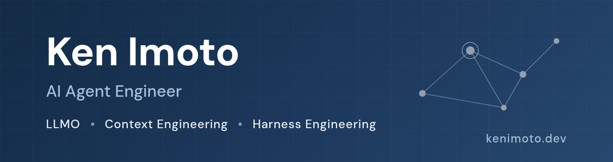
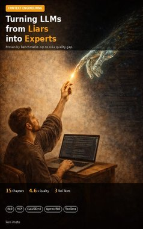
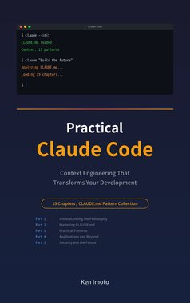
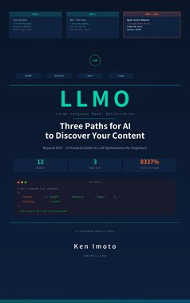
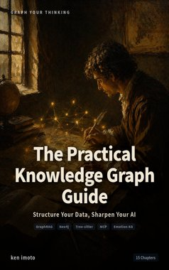

  
  
  
  
  
  
  

Creator of the [LLMO Framework](https://llmoframework.com). I design harnesses that automate dev, ops, and marketing with Claude Code — then publish what actually happened, with numbers.

  <b>400K+</b> article views (Qiita + Zenn)&nbsp;&nbsp;·&nbsp;&nbsp;<b>40+</b> books (Kindle + Zenn)&nbsp;&nbsp;·&nbsp;&nbsp;<b>4</b> research papers

  <b>Building AI-search-ready content? Start with the <a href="https://llmoframework.com">LLMO Framework</a>.</b>

  If this work has saved you time, you can support its continued maintenance through <a href="https://github.com/sponsors/kenimo49">GitHub Sponsors</a> or <a href="https://ko-fi.com/kenimo49">Ko-fi</a>.

### Products

| | |
|---|---|
| [**LLMO Framework**](https://llmoframework.com) | The open methodology for LLM Optimization (AEO + GEO) — getting your content found and cited by AI search |
| [**llmo-checker**](https://github.com/open-llmo/llmo-checker) | Lighthouse-style CLI that scores how AI-retrievable a URL is: llms.txt, JSON-LD, robots policy, semantic structure → 0–100 LLMO Score |
| [**compact-ops**](https://github.com/kenimo49/compact-ops) | Claude Code plugin that keeps sessions coherent across context compaction |

More: [open-llmo](https://github.com/open-llmo) (research initiative) · [voice-clone](https://github.com/kenimo49/voice-clone) (3-sec voice cloning on Qwen3-TTS) · [speech-habit-lens](https://github.com/kenimo49/speech-habit-lens) (speech analyzer) · [domain-pre-flight](https://github.com/kenimo49/domain-pre-flight) (domain checks) · [persona-hub](https://github.com/kenimo49/persona-hub) (persona SDK)

New products ship weekly: [kenimoto.dev → Products](https://kenimoto.dev/products/)

### Research

- When Free Executors Cost More: The Free-Executor Paradox in Iterative LLM Code-Repair Loops — [DOI:10.5281/zenodo.20978074](https://doi.org/10.5281/zenodo.20978074) · [code](https://github.com/kenimo49/free-executor-paradox)
- Excess Vocabulary in Japanese AI-Generated Text — [DOI:10.5281/zenodo.19233934](https://doi.org/10.5281/zenodo.19233934) · [code](https://github.com/kenimo49/excess-vocabulary-ja)
- AI Text Slop: Stylistic Convergence Across Six LLMs — [DOI:10.5281/zenodo.19173035](https://doi.org/10.5281/zenodo.19173035) · [code](https://github.com/kenimo49/ai-text-slop)
- AI Blue: Color Recognition Bias in Vision-Language Models — [DOI:10.5281/zenodo.19159702](https://doi.org/10.5281/zenodo.19159702) · [code](https://github.com/kenimo49/ai-blue-color-bias)

### Books

<table><tr>
<td align="center" width="16%"><a href="https://kenimoto.dev/books/harness-engineering-guide/"> <b>Harness&nbsp;Engineering</b></a></td>
<td align="center" width="16%"><a href="https://kenimoto.dev/books/context-engineering/"> <b>Context&nbsp;Engineering</b></a></td>
<td align="center" width="16%"><a href="https://kenimoto.dev/books/claude-code-mastery/"> <b>Claude&nbsp;Code</b></a></td>
<td align="center" width="16%"><a href="https://kenimoto.dev/books/llmo-ai-search-optimization/"> <b>LLMO</b></a></td>
<td align="center" width="16%"><a href="https://kenimoto.dev/books/knowledge-graph-practical-guide/"> <b>Knowledge&nbsp;Graph</b></a></td>
<td align="center" width="16%"><a href="https://kenimoto.dev/books/voice-ai-300ms-ux/"> <b>300ms&nbsp;Threshold</b></a></td>
</tr></table>

Full catalog (EN / JA / PT / ES): [kenimoto.dev → Publications](https://kenimoto.dev/#publications)

### Latest writing

<table><tr><td valign="top" width="33%">

### Blog (EN)

<!-- blog starts -->
[OpenAI Codex AGENTS.md: 1M Lines Shipped, 3 Harness Lessons](https://kenimoto.dev/blog/openai-codex-agents-md-1m-lines-3-harness-lessons/) — 2026-07-14

[Article Schema Alone Didn't Make AI Recognize Me as the Author. The Entity Wiring That Did (in 4 JSON-LD Fields).](https://kenimoto.dev/blog/article-schema-alone-author-entity-4-json-ld-fields/) — 2026-07-13

[I Forked OpenCut classic to Put an MCP Server on It — Four Traps I Hit Before Claude Could Drive the Video Editor](https://kenimoto.dev/blog/opencut-classic-mcp-4-traps-editor-core-fork/) — 2026-07-13

[Pre-flight your MCP: four layers to grade a server before you publish it](https://kenimoto.dev/blog/pre-flight-your-mcp-4-layers-scorecard/) — 2026-07-13

[The Skill Eval Repo I Didn't Build: 107 SKILL.md Files, 6 Checks, 21 False Positives](https://kenimoto.dev/blog/skill-eval-repo-not-built-107-lint/) — 2026-07-12
<!-- blog ends -->

More on [kenimoto.dev](https://kenimoto.dev/blog/)

</td><td valign="top" width="34%">

### Zenn (JA)

<!-- zenn starts -->
[Chaos 3ツールを3か月使い分けたら「本番向き」の意味が3つに割れた](https://zenn.dev/kenimo49/articles/chaos-3-tools-3month-litmus-mesh-fis) — 2026-07-14

[OpenCut classic を fork して MCP を入れた — Claude が動画編集する4つの罠](https://zenn.dev/kenimo49/articles/opencut-classic-mcp-4-traps) — 2026-07-13

[自作OSSを10観点で採点したら、直してはいけないFが2つ見つかった](https://zenn.dev/kenimo49/articles/repo-health-10-dimensions-two-fs) — 2026-07-12

[観測を1本のTrace IDに束ねたら、5層のうち3層がノイズだと分かった](https://zenn.dev/kenimo49/articles/observability-full-stack-trace-id-3-noise-layers) — 2026-07-11

[有名エンジニア10人のプロフィールREADMEを解剖したら7系統に分かれた](https://zenn.dev/kenimo49/articles/github-profile-readme-10-engineers-7-types) — 2026-07-10
<!-- zenn ends -->

More on [zenn.dev/kenimo49](https://zenn.dev/kenimo49)

</td><td valign="top" width="33%">

### Qiita (JA)

<!-- qiita starts -->
[YAMLを書くと企業サイト風の製品ヒストリー年表になるOSSを作った](https://qiita.com/kenimo49/items/159f75910f900f3e71f1) — 2026-07-11

[「どのベクトルDBがいい？」に「場合による」で逃げないRAGを作った](https://qiita.com/kenimo49/items/c5c64b836eabc5828948) — 2026-07-11

[uuidv7()とUUIDv4の差は何行から？PostgreSQL 18で実測](https://qiita.com/kenimo49/items/917d86d077dc1f2f1194) — 2026-07-10

[Claude Codeに『京都の雪夜』と頼んだら、家のPCで絵が出た話](https://qiita.com/kenimo49/items/25f26f4c2c3eb836f2aa) — 2026-07-06

[.envは.gitignoreに書いても漏れる:私が実演した3経路](https://qiita.com/kenimo49/items/be06d0fae54e34733124) — 2026-07-06
<!-- qiita ends -->

More on [qiita.com/kenimo49](https://qiita.com/kenimo49)

</td></tr></table>

If my tools or research helped you, you can [sponsor my open-source work](https://github.com/sponsors/kenimo49).

---

This README rebuilds itself daily via <a href="https://github.com/kenimo49/kenimo49/blob/main/.github/workflows/update-readme.yml">GitHub Actions</a>, pulling from <a href="https://kenimoto.dev/ai/publications.md">kenimoto.dev/ai/publications.md</a> (the AI-readable feed), Zenn, and Qiita. <!-- updated starts -->
Last refreshed: 2026-07-15 06:54 JST
<!-- updated ends -->
