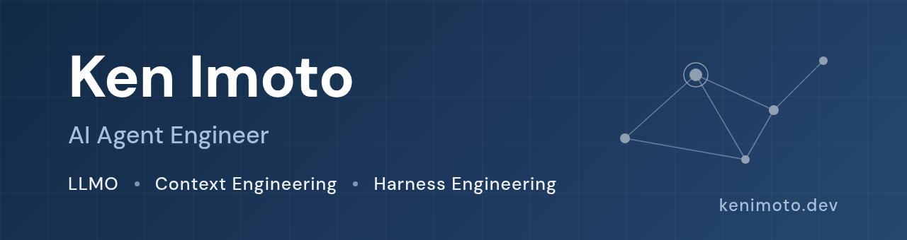
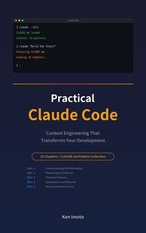

  
  
  
  
  
  
  

Creator of the [LLMO Framework](https://llmoframework.com). I design harnesses that automate dev, ops, and marketing with Claude Code — then publish what actually happened, with numbers.

  <b>400K+</b> article views (Qiita + Zenn)&nbsp;&nbsp;·&nbsp;&nbsp;<b>40+</b> books (Kindle + Zenn)&nbsp;&nbsp;·&nbsp;&nbsp;<b>4</b> research papers

  <b>Building AI-search-ready content? Start with the <a href="https://llmoframework.com">LLMO Framework</a>.</b>

  If this work has saved you time, you can support its continued maintenance through <a href="https://github.com/sponsors/kenimo49">GitHub Sponsors</a> or <a href="https://ko-fi.com/kenimo49">Ko-fi</a>.

### Products

| | |
|---|---|
| [**LLMO Framework**](https://llmoframework.com) | The open methodology for LLM Optimization (AEO + GEO) — getting your content found and cited by AI search |
| [**llmo-checker**](https://github.com/open-llmo/llmo-checker) | Lighthouse-style CLI that scores how AI-retrievable a URL is: llms.txt, JSON-LD, robots policy, semantic structure → 0–100 LLMO Score |

### kenimoto Claude Code Kit

A focused set of tools I use daily to keep Claude Code sessions productive across long work. Follow one, you'll want the others.

| | |
|---|---|
| [**compact-ops**](https://github.com/kenimo49/compact-ops) | Preserve session state across `/compact` — no lost context, no manual re-briefing |
| [**claude-shift**](https://github.com/kenimo49/claude-shift) | Switch between multiple Claude Code accounts safely; observe 5-hour / weekly usage across them |
| [**hook-chain-lens**](https://github.com/kenimo49/hook-chain-lens) | Diagnose your Claude Code hooks: see the merged fire order across user / project / plugin scopes, catch dead matchers and missing script paths |

More: [open-llmo](https://github.com/open-llmo) (research initiative) · [voice-clone](https://github.com/kenimo49/voice-clone) (3-sec voice cloning on Qwen3-TTS) · [speech-habit-lens](https://github.com/kenimo49/speech-habit-lens) (speech analyzer) · [domain-pre-flight](https://github.com/kenimo49/domain-pre-flight) (domain checks) · [persona-hub](https://github.com/kenimo49/persona-hub) (persona SDK)

New products ship weekly: [kenimoto.dev → Products](https://kenimoto.dev/products/)

### Research

- When Free Executors Cost More: The Free-Executor Paradox in Iterative LLM Code-Repair Loops — [DOI:10.5281/zenodo.20978074](https://doi.org/10.5281/zenodo.20978074) · [code](https://github.com/kenimo49/free-executor-paradox)
- Excess Vocabulary in Japanese AI-Generated Text — [DOI:10.5281/zenodo.19233934](https://doi.org/10.5281/zenodo.19233934) · [code](https://github.com/kenimo49/excess-vocabulary-ja)
- AI Text Slop: Stylistic Convergence Across Six LLMs — [DOI:10.5281/zenodo.19173035](https://doi.org/10.5281/zenodo.19173035) · [code](https://github.com/kenimo49/ai-text-slop)
- AI Blue: Color Recognition Bias in Vision-Language Models — [DOI:10.5281/zenodo.19159702](https://doi.org/10.5281/zenodo.19159702) · [code](https://github.com/kenimo49/ai-blue-color-bias)

### Books

<table><tr>
<td align="center" width="16%"><a href="https://kenimoto.dev/books/harness-engineering-guide/"> <b>Harness&nbsp;Engineering</b></a></td>
<td align="center" width="16%"><a href="https://kenimoto.dev/books/context-engineering/"> <b>Context&nbsp;Engineering</b></a></td>
<td align="center" width="16%"><a href="https://kenimoto.dev/books/claude-code-mastery/"> <b>Claude&nbsp;Code</b></a></td>
<td align="center" width="16%"><a href="https://kenimoto.dev/books/llmo-ai-search-optimization/"> <b>LLMO</b></a></td>
<td align="center" width="16%"><a href="https://kenimoto.dev/books/knowledge-graph-practical-guide/"> <b>Knowledge&nbsp;Graph</b></a></td>
<td align="center" width="16%"><a href="https://kenimoto.dev/books/voice-ai-300ms-ux/"> <b>300ms&nbsp;Threshold</b></a></td>
</tr></table>

Full catalog (EN / JA / PT / ES): [kenimoto.dev → Publications](https://kenimoto.dev/#publications)

### Latest writing

<table><tr><td valign="top" width="33%">

### Blog (EN)

<!-- blog starts -->
[GitHub Copilot Agent Mode vs Claude Code: 8 Tasks, 31 Days, Real Bills](https://kenimoto.dev/blog/github-copilot-agent-mode-vs-claude-code-8-tasks-31-days/) — 2026-08-13

[Claude Code vs Aider on Same 10 Tasks — One Finished 8, the Other 5](https://kenimoto.dev/blog/claude-code-vs-aider-10-tasks-eight-vs-five/) — 2026-08-12

[Claude Code vs Qwen3-35B on RTX 4070: 34.6 tok/s Break-even](https://kenimoto.dev/blog/claude-code-vs-qwen3-35b-rtx-4070-benchmark/) — 2026-08-11

[Karpathy's nanochat on a MacBook: End-to-End runcpu.sh Log from Tokenizer to Chat (2026)](https://kenimoto.dev/blog/karpathy-nanochat-macbook-runcpu-end-to-end-log/) — 2026-08-06

[Claude Code Has Two Authentication Layers. setup-token Is Not the Same as login.](https://kenimoto.dev/blog/claude-code-two-layer-auth-setup-token/) — 2026-08-05
<!-- blog ends -->

More on [kenimoto.dev](https://kenimoto.dev/blog/)

</td><td valign="top" width="34%">

### Zenn (JA)

<!-- zenn starts -->
[CLAUDE.mdパターンを15個試したら、実運用に残ったのは4つだけだった](https://zenn.dev/kenimo49/articles/claude-md-15-patterns-4-survived) — 2026-08-12

[Few-shot例を5個渡したら、AIが真似したのは最後の1個だけだった](https://zenn.dev/kenimo49/articles/few-shot-5-examples-only-last-mimicked) — 2026-08-11

[MCPで7サービスにファイルを送ろうとしたら、完全動作は1つだけだった](https://zenn.dev/kenimo49/articles/mcp-7-services-file-upload-1-worked) — 2026-08-09

[ハーネスのフィードバックループを4種類に分けたら、機能してたのは1つだけだった](https://zenn.dev/kenimo49/articles/harness-feedback-loops-4-only-1-worked) — 2026-08-08

[6段階レビューを90日回したら、Stage 3に指摘の6割が集中していた](https://zenn.dev/kenimo49/articles/code-review-6stages-90days-stage3-6-percent) — 2026-08-07
<!-- zenn ends -->

More on [zenn.dev/kenimo49](https://zenn.dev/kenimo49)

</td><td valign="top" width="33%">

### Qiita (JA)

<!-- qiita starts -->
[自宅カラオケの伴奏をOSSで作ろうとして、詰む場所が3回変わった話](https://qiita.com/kenimo49/items/002aab35f383780beaa6) — 2026-08-11

[Claude Code で複数アカウントを切り替えるとき、UIのactiveと実際の実行アカウントが食い違う理由](https://qiita.com/kenimo49/items/3491432793c66b5c7805) — 2026-08-05

[RTX 4070で動く12モデルを4タスクで実測した — 翻訳・要約・コード・数学の適性マトリクス](https://qiita.com/kenimo49/items/c0bbd37ccfa4b999f300) — 2026-08-03

[Claude Code Skills 60個を4ヶ月運用した私の稼働率実測 — 10個は毎日/50個は死蔵だった](https://qiita.com/kenimo49/items/d3f11568e0a0e7396007) — 2026-08-03

[60秒の曲は20秒、5秒の効果音は4分 — RTX 4070ローカル音声生成の実測](https://qiita.com/kenimo49/items/5c88389d746687e1a7ad) — 2026-08-03
<!-- qiita ends -->

More on [qiita.com/kenimo49](https://qiita.com/kenimo49)

</td></tr></table>

If my tools or research helped you, you can [sponsor my open-source work](https://github.com/sponsors/kenimo49).

---

This README rebuilds itself daily via <a href="https://github.com/kenimo49/kenimo49/blob/main/.github/workflows/update-readme.yml">GitHub Actions</a>, pulling from <a href="https://kenimoto.dev/ai/publications.md">kenimoto.dev/ai/publications.md</a> (the AI-readable feed), Zenn, and Qiita. <!-- updated starts -->
Last refreshed: 2026-08-14 06:16 JST
<!-- updated ends -->
